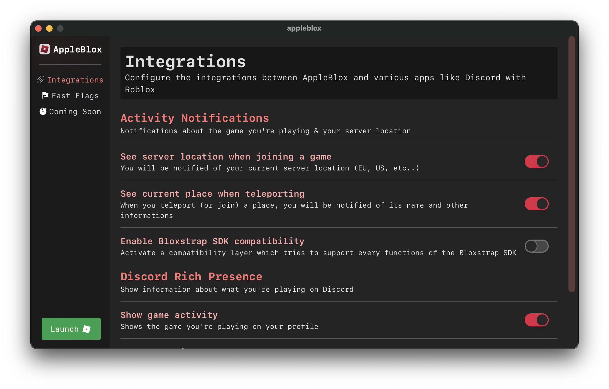
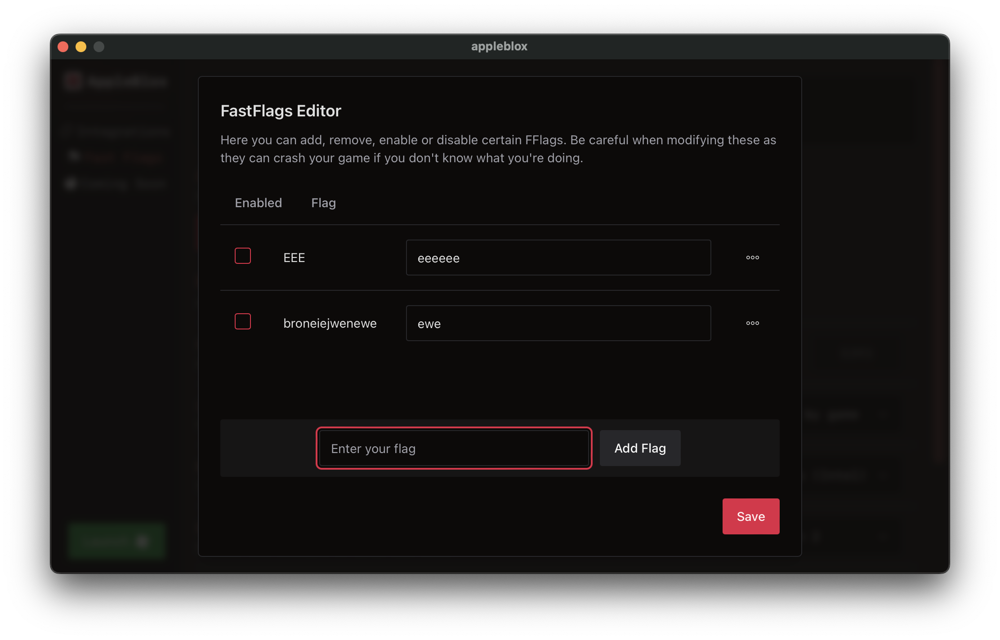

    

---

# AppleBlox

AppleBlox is a simple Roblox launcher for **MacOS**, heavily inspired by [Bloxstrap](https://github.com/pizzaboxer/bloxstrap).
Currently, the app is in developpement and lacks important features like launching roblox (Only the settings panel system has been done.)

You can get a demo of the app from the [Releases](https://github.com/OrigamingWasTaken/appleblox/releases/tag/0.0.1)

## Developpement

To setup the app on your machine, clone this repo and run `npm install`.
To start the **dev environnement**, run `npm run dev`.
To **build and package the app**, run `npm run build`.

The app is made with [Svelte](https://svelte.dev) (Frontend) and [NeutralinoJS](https://neutralino.js.org) (Backend).
If you haven't heard about NeutralinoJS, it is a lightweight alternative coded in **c++** to frameworks like Electron or NW.JS. It is still growing, but is stable enough to be used on one platform. You can learn more about it on https://neutralino.js.org/docs.

## Contributing

All contributions are welcome! Feel free to open issues and pull requests. For further discussion, contact me at `contact@origaming.ch` or on discord `@Origaming`.

## Gallery

    
    

## Credits

Logo found on https://macosicons.com (Sorry but I couldn't find the designer's name ^^').
Features inspirations from BloxStrap.