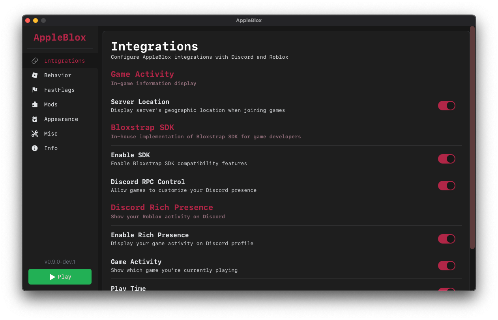
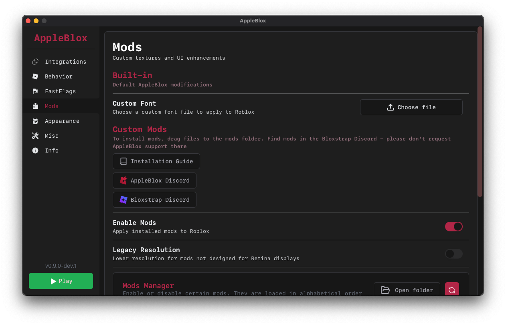

    

---

# AppleBlox

AppleBlox is a simple Roblox launcher for **MacOS**, heavily inspired by [Bloxstrap](https://github.com/pizzaboxer/bloxstrap).
Supports DiscordRPC, Fast-flags & more to come.

You can get a demo of the app from the [Releases](https://github.com/OrigamingWasTaken/appleblox/releases/latest)

For more recent builds, see the [nightly releases](https://nightly.link/OrigamingWasTaken/appleblox/workflows/build/main?preview)

# Features

#### Integrations

- **Discord Rich Presence**, show which games you're playing, when you started, and supports buttons to join your server. If the Bloxstrap SDK settings has been enabled, games will be able to set custom rich presence.
- **Server notifications**, when joining a server, you will be notified of its location. (Exemple: Paris, Île-de-France, FR)
- **Bloxstrap SDK**, AppleBlox supports many features from Bloxstrap including [the sdk](https://github.com/pizzaboxer/bloxstrap/wiki/Integrating-Bloxstrap-functionality-into-your-game). This let's games set custom **discord rich presence**, and with our addons, much more like control the Roblox window ([see this exemple for a rythm game](https://streamable.com/jwidvp?t=55)).

#### Fast Flags

- **Presets**, you can use various presets to tweak your game. Things like: FPS cap, lightning technology, rendering engine, etc... Some can be used to get better performance in-game.
- **Advanced Editor**, you can also add your own FastFlags using the advanced editor. You can add flags, set their value, and enable / disable them. All modifications will be carried across Roblox updates.

#### Mods

You can add mods to tweak Roblox's UI via the `~Library/AppleBlox/Mods` folder (there is a button in the app to open it). To do so, simply drag a Mod folder into this location. Exemple:

Then, from AppleBlox, you can choose to enable / disable mods globally or individually. Please note that mods are loaded in alphabetical order (123,abc).

#### Misc Features

- **Multi-instances**, launch multiple windows of Roblox at the same time. Please note that AppleBlox only tracks data of **1** window, launched from the main menu.
- **Launch Shortcut**, easily save a shortcut to launch Roblox directly.

...and more.

## Pre-compiled Binaries

AppleBlox contains pre-compiled binaries of some programs at `build/lib/MacOS` from:
- https://github.com/vjeantet/alerter (Taken from the github releases)
- https://github.com/Rayrsn/Discord-RPC-cli (Built from source on my machine)
- https://github.com/OrigamingWasTaken/utility_cli (Built from source on my machine)

I plan on modifying this to compile those binaries at build step, but that would mean having to install Rust and Xcode, so I'm not really sure...
If you're worried that those could be modified by me or another contributor to include malicious code, you can look at the "VirusTotal Scan" GitHub workflow. This workflow scans the release assets for malicious code.

## Developpement

To setup the app on your machine, clone this repo and run `npm install`. You will also need to install some packages with the command: `brew install create-dmg`.

To start the **dev environnement**, run `npm run dev`.

To **build**, run `npm run build`. (If you don't want to create dmgs)

To **build and package the app**, run `npm run build:release`.

The app is made with [Svelte](https://svelte.dev) (Frontend) and [NeutralinoJS](https://neutralino.js.org) (Backend).
If you haven't heard about NeutralinoJS, it is a lightweight alternative coded in **c++** to frameworks like Electron or NW.JS. It is still growing, but is stable enough to be used on one platform. You can learn more about it on https://neutralino.js.org/docs.

## Contributing

All contributions are welcome! Feel free to open issues and pull requests. For further discussion, contact me at `contact@origaming.ch` or on discord `@Origaming`.

## Gallery

    
    
    
    
    
    
    

## Credits

Logo found on https://macosicons.com (Sorry but I couldn't find the designer's name ^^').
Features inspirations from BloxStrap.
