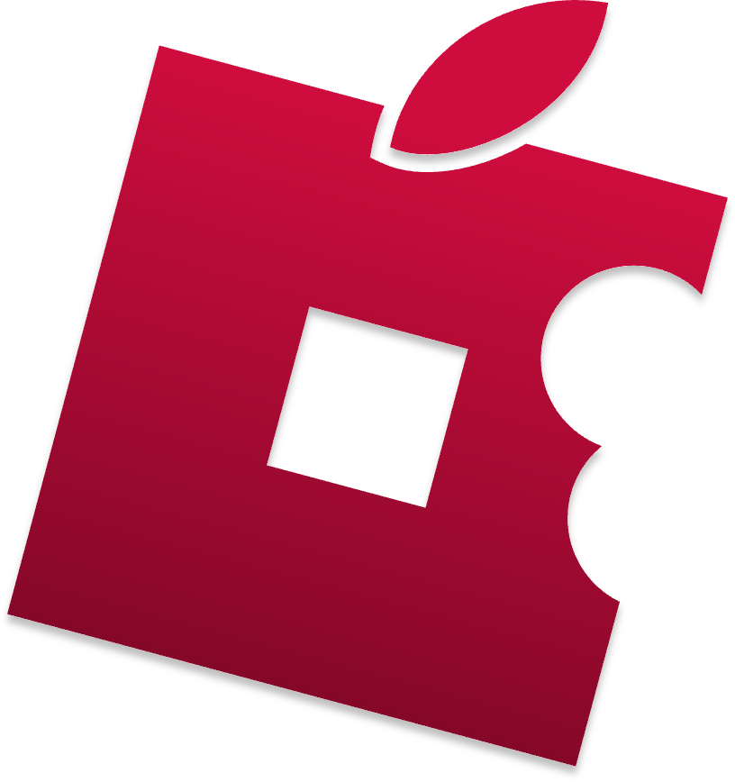
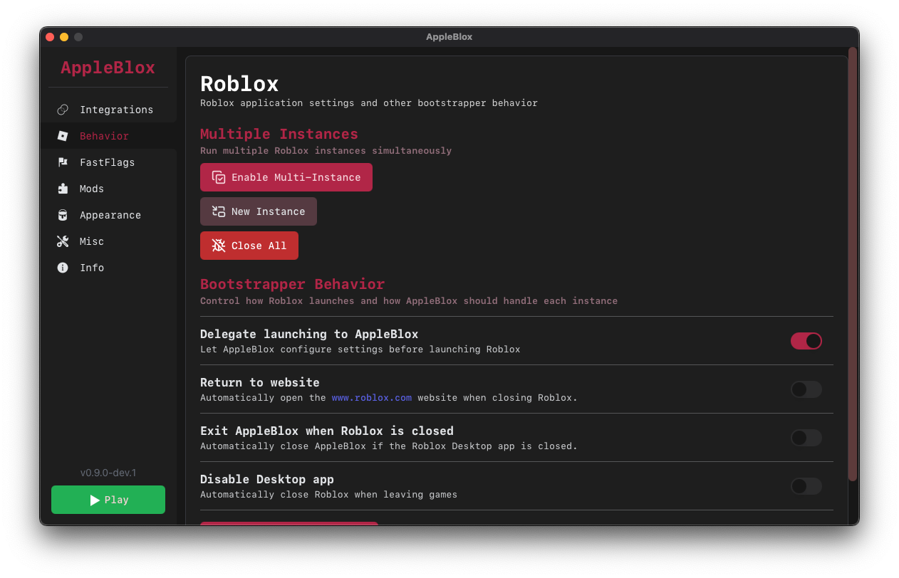
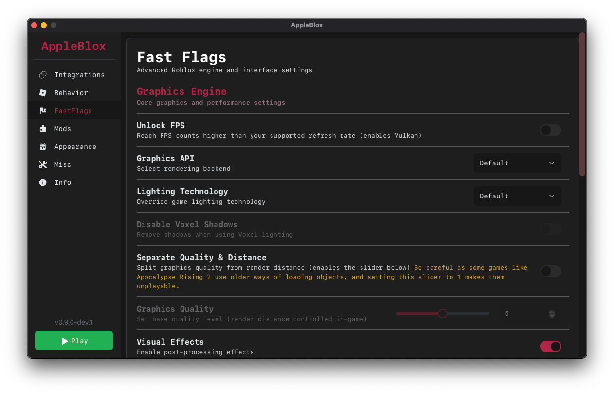

# AppleBlox

---

AppleBlox is a Roblox launcher for **MacOS**, inspired by [Bloxstrap](https://github.com/pizzaboxer/bloxstrap). It includes features such as DiscordRPC and Fast-flags, with ongoing development for additional functionality.

The latest version is available on the [Releases](https://github.com/AppleBlox/appleblox/releases/latest) page. For more recent builds, see the [nightly releases](https://nightly.link/AppleBlox/appleblox/workflows/build/main?preview).

Versions:

- arm64 (Apple's own chips: M1, M2, M3, etc)
- x64 (Intel Architecture)
- universal (Universal Version)

For the development version (more unstable but has the latest features and more) see the [development releases](https://nightly.link/AppleBlox/appleblox/workflows/build/dev?preview)

## Features

- Server Notifications: Displays the hosting region of the game server.
- Discord Rich Presence: Integrates with Discord to show gaming activity.
- FFlags Presets: Provides pre-configured Fast flags settings.
- Custom Flags: Allows creation of custom FastFlags profiles, including game-specific configurations.
- Multi-instance (Experimental): Enables running multiple Roblox windows simultaneously.
- Mods: Supports UI customization through community-created mods.
- Bloxstrap SDK: In-house implementation of Bloxstrap SDK for game developers.

## App Related Features

- Customizable Appearance: Allows for a different design for the app using community-made themes.
- Delegate Launching to Appleblox: Let AppleBlox configure settings before launching Roblox.
- Disable Roblox Desktop App: Automatically close Roblox when leaving games.

## Development

Setting up the AppleBlox development environment:

1. Clone the repository
2. Execute `bun install`
3. Install additional dependencies: `brew install create-dmg`

Development commands:

- `bun run --bun dev`: Start the development environment
- `bun run --bun build`: Package the application (excluding DMG creation)
- `bun run --bun release`: Package and create a DMG

AppleBlox is built using [Svelte](https://svelte.dev) for the frontend and [NeutralinoJS](https://neutralino.js.org) for the backend. NeutralinoJS is a lightweight C++ alternative to Electron or NW.JS, suitable for single-platform applications. More information is available at [neutralino.js.org/docs](https://neutralino.js.org/docs).

## Pre-compiled Binaries

The build script utilizes pre-compiled binaries for `alerter` and `discord-rpc-cli` to simplify the build process:

- `alerter`: Sourced from [vjeantet/alerter](https://github.com/vjeantet/alerter) releases
- `discord-rpc-cli`: Built from [AppleBlox/Discord-RPC-cli](https://github.com/AppleBlox/Discord-RPC-cli)

## Contributing

Contributions are welcome. Please feel free to submit issues, pull requests, or discuss ideas. For further discussion, contact `contact@origaming.ch` or reach out on Discord `@Origaming`.

## Gallery

    
    
    
    
    
    
    

## Credits

- Logo: @typeofnull
- Inspiration: @pizzaboxer's Bloxstrap
- Icons: lucide-svelte & icons8
- Objective-C sidecar: Generated with assistance from ClaudeAI and ChatGPT. Contributors are sought to replace this code.
-
